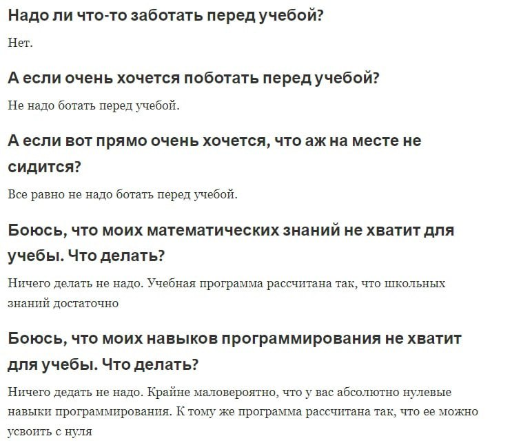

# Частые вопросы про направления ФПИиКТ
[⬅Полезная информация](./index)

// можно копировать ссылку на конкретный пункт //

- - - 
Оглавление:
1. [Административные вопросы](#административне-вопросы)
2. [Образование](#образование)
3. [Внеучебная жизнь](#внеучебная-жизнь)
4. [Общее](#общее)
- - - 

## Административные вопросы
### 1.1. 
> Чем *мегафакультет* отличается от *факультета*? 

Условно, образование в ИТМО можно разделить:
1. Мегафакультет (например, КТиУ)
2. Факультет (например, ПИиКТ)
3. Образовательная программа (например, СППО)

**Образовательная программа** — это набор предметов, дисциплин отвечающий определенному [*направлению*](https://base.garant.ru/70480868/53f89421bbdaf741eb2d1ecc4ddb4c33/) (=код от мин. обр.). Разные образовательные программы, отвечающие одному направлению, могут различаться: разные преподаватели, дополнительные предметы и т.д., проще говоря, это *красивое* название, придуманное университетом.
- заявление на поступление подается на *направление* ❗❗ (см [1.3.](#13) для большего пояснения)

**Факультет** — объединение образовательных программ. 

**Мегафакультет** — это что-то вроде кафедры, такие крупные объединения факультетов общей направленности: физика, биология, программирование, информатика, экономика...
- раньше были кафедры, но потом их упразднили и оставили мегафакультеты 

Схематично можно изобразить так:

 
	

### 1.2. 
> Что такое ВТ?

*ВТ* (Вычислительная техника) — название кафедры, которая раньше существовала; сейчас употребляется для обозначается для группы обр. программ направленных на углубленное изучение работы компьютера, условно ~ СППО + ИВТ.
- см. [стикеры в тг](https://t.me/addstickers/trueVT).

### 1.3.
> Куда я попаду, подавая заявление на выбранное направление?

(отсылка к [1.1.](#11))

Сложность состоит в том, что абитуриент выбирает именно *образовательную программу*, которая соответствует конкретному *направлению подготовки*, определенному мин. обр.

Конкурс на зачисление происходит в рамках одного направления подготовки. Поэтому есть нюансы:
- именно на направления выделяются бюджетные места,
- разные обр. программы могут делить общие бюджетные места, например, СППО и Нейротех.

Процесс подачи заявления на поступление выглядит **примерно** так: Абитуриент
1. выбирает на сайте [abit.itmo.ru](https://abit.itmo.ru) понравившиеся ему образовательные программы (*красивое* название),
2. убедиться, что обр. программы соответствующие разным *направлениям подготовки* (= код),
3. составляет заявления на конкурс по выбранным обр. программам,
4. подтверждает свое намерение, принося аттестат.

### 1.4.
> По какому принципу селят в общежития?

Вроде бы нигде не говорится, по какому принципу расселяют по общежитиям, т.е. случайным образом.

Но некоторые утверждают, что расселение происходит в зависимости от количества баллов за ЕГЭ по предмету олимпиады в случае БВИ. Тут возникает вопрос, "а какая общага лучше?", на который нет однозначного ответа.
- *Вязьма* ближе всего к корпусам, но там можно попасть в *коридорку,* и в целом она не такая отремонтированная как та же *Белка*.

## Образование
### 2.1. 
> Кем я стану, когда окончу СППО/ИВТ?

Образовательные программы привязаны к направлению подготовки (см [1.1.](#1.1.)), это объясняется в первой же лекции по предмету "Основы профессиональной деятельности".

СППО = Программная Инженерия 09.03.04
ИВТ = Информатика и Вычислительная техника 09.03.01
- вырезка из презентации: [t.me/abit_cse/1874](https://t.me/abit_cse/1874).
- [Видео на YT «Кто такие системные программисты?»](https://youtu.be/ywUvhPsd6Ew)

Можно научиться [*системному программированию*](https://youtu.be/ywUvhPsd6Ew), работе с микроконтроллерами, разработке сложных приложений и др.

### 2.2
> Чем СППО отличается от ИВТ?

СППО и ИВТ – это разные образовательные программы отвечающие разным направлениям подготовки.
- см. [2.1.](#21)

Если очень грубо:
- ИВТ = процессоры, микросхемы,
- СППО = операционные системы, веб-технологии.

Подробнее:
- на ИВТ занимаются более *низкоуровневым* программированием, работа идет ближе *к железу*: процессоры и микросхемы, есть предметы функциональной схемотехники (не паять, а рисовать схемы),
- на СППО занимаются более *высокоуровневым* программированием, работа идет на более высоком уровне абстракций: высоконагруженные системы, облачные сервисы.

При этом нужно понимать, что есть возможности совмещения этих образовательных программ: 
- ~~специализации~~ (было)
	- СППО: ПИС (веб) + Системное Программное Обепечение (железо),
	- ИВТ: Встроенные системы (железо) + Распределенные Системы и Сети (веб);
- **майноры** (стало)
	- хз, еще не сталкивались, можно более точно выбирать набор предметов.

Более того, **первые два год**а обучения практически, если не совсем, совпадают, т.е. те же самые предметы на этих направлениях и даже лекторы те же. 
- следовательно *проще всего(?)* переводиться между этими обр. программами.

### 2.3.
> Что лучше: КТ или СППО?

Во-первых, КТ это тоже условное название направления Прикладная математика и информатика на факультете ИТиП, как условное название ВТ (см [1.2.](#12)).

Это разные направления подготовки (см. [1.1](#11)):  КТ Прикладная Математика и Информатика (ПМИ) и СППО Программная Инженерия (ПИ). Отсюда вся разница:
- КТ  — это больше про математику, про алгоритмы, высокоуровневое программирование, работу с компьютером,
- СППО/ИВТ — это больше про компьютерное железо, системы, устройство/разработку компьютера.

Так же на обр. программах свои наборы предметов, которые достаточно сильно отличаются (см. [2.5./КТ](#25)). 
- На КТ по умолчанию более сильная, более абстрактная математика,
- На ВТ 2 потока: продвинутая и базовая (см. [2.4.](#24)).
 
### 2.4. 
> Что с математикой на СППО?

В 2021 году затеивались изменения в образовании на ВТ, но из-за политической ситуации активность изменений упала. Сейчас имеется Продмат и Базмат.
- В ИТМО есть библиотека, где можно брать различные учебники и справочники для самостоятельного изучения.
- смотри вопрос далее.

#### 2.4.1.
> Что такое *продмат*?

Основные разделы математики.

На ВТ с 2021 года 2 потока математики: 
- продвинутая математика (*продмат*),
- базовая математика (базмат).

*Продмат* — курсы более абстрактной математики, они содержат:
- курс [алгебры](https://logic.pdmi.ras.ru/~dvk/ITMO/Algebra) ([Карпов Д. В.](https://logic.pdmi.ras.ru/~dvk/)),
- курс [дискретной математики](https://logic.pdmi.ras.ru/~dvk/ITMO/DM) ([Карпов Д. В.](https://logic.pdmi.ras.ru/~dvk/), [Пастор А. В.](https://logic.pdmi.ras.ru/~pastor/)),
- курс [математического анализа](https://youtube.com/playlist?list=PLx5jwZiVE4CVattiY9JA_k03Chu6FtcMp) ([Бойцев А. А.](https://www.youtube.com/@user-kc3hm4oe9p)).
Преподаватели на продмате прежде преподавали на КТ и ИБ. (Непонятно, кто будет вести у первого курса, т.к. Бойцев сейчас занят).
- Курсы глубокие, затрагивают множество тем, но более абстрактно, чем на *базмате*, т.е. без привязки к применению в профессии.

*Базмат* — в основном старые курсы (после ввода продмата пришлось добавить и доработать некоторые вещи) математики, которые проходят, как правило, больше тем, чем на продмате, но более *поверхностно*. Так же есть важные темы, которые направлены на будущую профессиональную деятельность, которых нет на *продмате*. 

#### 2.4.2.
> Как попасть на *продмат*?

В начале года проводится тестирование, после успешного прохождения которого вы можете попасть в поток продвинутой математики.
- Тестирование скорее формальное, для собственной оценки сил, т.к. даже без него можно попасть на продмат, показав свою решимость.
- Не попав туда среди первых, можно попасть немного позже, когда люди начнут отваливаться.
- Как правило, большая часть возвращается на базмат в течение первого-второго семестра из-за высокой нагрузки.

#### 2.4.3.
> Хочу изучать математику, что еще есть?

В рамках модуля внутреакадемической мобильности [ОГНП](https://student.itmo.ru/ru/elective_module/) можно выбрать курсы с КТ:
- математическая логика (курс на Stepik от [@shd](https://github.com/shd)),
- функциональный анализ.

Так же есть общие курсы других разделов математики:
- математическая статистика,
- теория вероятностей,
- вычислительная математика, 
- машинное обучение
(см. [online-курсы 2.5.](#25)).

Общие курсы математики **трудно назвать очень хорошими** (искл. онлайн-курсы), но они дают базовые представления о разделах математики, подходят для тех, кто слабо знаком с математикой.

### 2.5.
> Что с переводами между образовательными программами?

Переводы между образовательными программами бывают, но не очень часто.

В основном люди переводятся между СППО/ИВТ и нейротехом, т.к. очень схожие образовательные программы.

Не выдержавшие обучения на ВТ часто переходят на Технологии в Дизайне (см. [3.1.](#31)).

Есть случаи перехода с ВТ на КТ, но в этом случае достаточно большая академ-разница и очень трудно закрыть долги, чем позже переход, тем сложнее.

Бывает люди переводятся из других вузов, бывает даже с не очень похожих направлений. 

### 2.4. 
> Что с физикой на ВТ?

Физика есть, в новом учебном плане она должна быть на 2м курсе. Глубокого знания физики не требуется, обучение начинается с основ с применение полученных знаний по математическому анализу.

Обещают новую учебную программу физики, более полезную, с уклоном на практическое применение (?). Ее ни у кого не было, поэтому сказать сложно, что получится.

В 2022г. на ИВТ была в экспериментальном режиме новая физика, вроде бы она всем *понравилась* и была "*очень* простая".
В это время на СППО была старая физика, качество которой зависело от преподавателя: бывало душно и непонятно, а бывало непринужденно и понятно.

### 2.5.
> Какие онлайн курсы на ВТ?

В ИТМО много общеуниверситетских онлайн-курсов. Вот примеры изучаемых на ВТ:
- [введение в цифровую культуру](https://openedu.ru/course/ITMOUniversity/DIGCUL/?session=fall_2021_ITMO),
- [хранение и обработка данных](https://openedu.ru/course/ITMOUniversity/DATST/?session=spring_2022_ITMO_bac),
- [прикладная статистика](https://openedu.ru/course/ITMOUniversity/APPSTAT/?session=fall_2022_ITMO),
- [машинное обучение](https://openedu.ru/course/ITMOUniversity/MLDATAN/?session=spring_2023_ITMO_bac),
- [Безопасность жизнедеятельности](https://openedu.ru/course/ITMOUniversity/LSBASIC/?session=spring_2023_ITMO) (БЖД),
- [Встроенные системы](https://openedu.ru/course/ITMOUniversity/EMBSYS/?session=spring_2023_ITMO),
- ....
- Вычислительная математика (?).

Качество курсов есть разное, т.к. их составляют разные люди. Например, 
- БЖД выглядит как бесполезная трата времени, 
- Цифровая культура довольно поверхностная и *прошаренным юзерам* вообще не пригодится,
- Встроенные системы в принципе неплохой курс, для начинающих.

Отдельное внимание хочется уделить курсам, в которых участие принимает Антон Бойцев. Не знаю, его это заслуга или нет, но у них высокое качество:
- курс прикладной статистики на 2 курсе 3 семестр обучения покрывает курс теории вероятностей и статистики на 2 курсе 4 семестр,
- в каждом курсе есть проработанные текстовые материалы, которые можно использовать как самостоятельный учебник.

Онлайн курсы, как правило, не вызывают трудностей при прохождении, если не пропускать *дедлайны*.

### 2.6.
> Стоит ли поступать в ИТМО?

ИТМО, **как и другие ВУЗы** не обделен недостатками.
- см. [презентацию для абитуриентов](https://t.me/abit_cse/460)

Прими следующие тейки.
- Совершенно верный выбор сделать не получится.
- ВУЗ — место, где ты учишься учиться.
- Твои интересы могут измениться через год.
- просто круто/не круто не бывает — смотри в суть.

PS. Не стоит. Бросай это дело. Чудиков тут и так достаточно. :o)

### 2.7.
> Что нужно знать до начала обучения?

В принципе образовательный план построен так, чтобы можно было слушать курс без глубоких знаний по теме. Всё же рекомендую иметь какие-то общие представления о курсах изучаемых на первом курсе, чтобы не пришлось тратить много времени на восстановление базовых знаний.

Важнее всего **уметь гуглить** и не бояться **английского языка**.

Желательно:
- из программирования иметь опыт написания простеньких консольных программ;
- из *ОПД* знать примерное устройство компьютера, посмотреть видосики про Linux, поизучать командную строку;
- из математики знать то, что спрашивается в профильном ЕГЭ.

PS. смотри [гайд](./guide).

### 2.8.
> Даст ли ВТ мне хороший фундамент, чтобы я могу потом пойти в любую айтишную сферу?

Для хорошего программиста полезно иметь знания, хотя бы общие, о работе программ на компьютере, вот некоторые причины:
- более удобное взаимодействие с коллегами,
- возможность узнать, что делает код, спустившись на уровень ближе к железу,
- возможность сменить свою сферу деятельности,
- системное мышление.

Так же стоит понимать, что **не все знания одинаково легко получить**, к примеру, научиться верстать сайтики можно за один вечер имея доступ в интернет, но вот узнать без посторонней помощи, как работают вычислительные машины в своей основе  — очень не легко. 

Именно этим и помогает ВТ. Здесь даются знания из разных сфер деятельности, но в первую очередь о работе компьютера на разных уровнях, стараются сформировать системное мышление. 

При этом не ограничивают в изучении смежных сфер деятельности, будь то дизайн интерфейсов, работа с базами данных, информационная безопасность...
- Побочные курсы не такие проработанные, но дают общие представления о темах. Углубленное изучение которых остается на волю студента.
- см. [2.1.](#21)

На ВТ дают хорошую математическую базу, т.е. необходимые знания, с которыми можно в дальнейшем вести углубленное изучение.
- см. [2.4.+](#24)
Есть курсы физики, на которых рассказываются основные темы, с которыми есть шанс столкнуться в реальной жизни.
Есть общеуниверситетские модули мобильности и другие побочные курсы...
- курс английского в профессиональной сфере (3 курс)

Стоит отметить, что побочные курсы не всегда хорошо адаптированы под нужды направления.

### 2.9. 
> Что выбрать, ИС или ВТ?

Это разные направления с очень похожими учебными планами, только предметы определены в разные категории (жуть..).
Эти обр. пр. относятся к разным факультетам и поэтому по-разному организован процесс обучения.

Объяснения разницы которые удалось найти.
- Декан ПИиКТ, Кустарёв Павел Валерьевич о разнице между СППО и ИС (вк видео с таймкодом 1:44:31)
	- https://vk.com/video-166875517_456239084?t=1h44m31s
- В ходе обсуждений со студентами ИС пришел к выводу (уточните в приемке ИС):
	- на ИС мало *низкоуровневого* программирования (одна лаба или вроде того), в то время как на ВТ его куда больше (довольно подробное изучение ЭВМ, не одна лаба на ассемблер, программирование модулей ядра...)

Так же, т.к. это разные факультеты, по разному обстоит дело с переводами — ИС гораздо проще перевестись на КТ, чем с условного СППО.

## Внеучебная жизнь
### 3.1.
> Что на ВТ с девушками?

По непонятным причинам 😕 на ВТ очень мало девушек, в сравнении с другими факультетами. После первого семестра большая их часть еще и переходит на Дизайн.

Но это не страшно, ведь есть общеуниверситетские занятия типа Soft Skills (КиК, ТПВ...), где можно обзавестись интересными знакомствами.

## Общее
### 4.1.
> Какой ноутбук выбрать?

Для учебы не нужен мощный игровой ноутбук, достаточно *"офисной машинки"*. 

Перечислю важные характеристики и их минимальные и *идеальные* значения, дальше пояснения.
- **экран**
	- min - 13-14 дюймов
	- 14" или 15" тонкие рамки, дополнительный монитор
- **процессор**
	- min - 4+ ядра 2.4+ ГГц
	- свежие модели AMD/Intel с 4-8 ядрами 2.4+ ГГц, Apple Silicone
- **видеокарта**
	- встроенное видеоядро в свежих моделях процессоров (дискретная бессмысленна)
- **оперативная память**
	- min - 8 ГБ (6 + 2gpu)
	- 16+ ГБ
- **постоянная память**
	- min - SSD 256+ ГБ и HDD
	- SSD 512-1024+ ГБ 
- **аккумулятор, время работы**
	- min - 3 часа автономной работы
	- 7-8+ часов 
- **вес, размер**
	- чем легче — тем лучше, в идеале до 1.5 кг. Размер зависит от диагонали экрана.
- **операционная система**
	- min - Win 7 / linux 4
	- Win 11(10) / linux 5 / macos 10 
- **эргономика**
	- в идеале Блок питания покомпактней, зарядка USB type-c
- **дополнительно**
	- HDMI, USB-A, USB type-c, Ethernet и пр. в необходимом для вас количестве

Понятно, что *чем больше — тем лучше*, но есть нюансы:
- **Экран**
	- большой экран влечет большие габариты ноутбука, на большей диагонали удобнее работать
	- 14" вполне комфортный размер. В идеале иметь возможность подключить дополнительный монитор
	- качество дисплея (цветопередача, частота обновления, покрытие) довольно важно, т.к. за ним придется проводить много времени
	- 60 Гц дисплея достаточно. Чем больше частота — тем быстрее разряжается
- **Процессор**
	- современные процессоры для ноутбуков очень хороши, AMD 5000 серии (с суффиксом U), Intel 10+ поколения (суффикс G), Apple Silicon в Mac Book
	- процессорам следует иметь низкую базовую частоту, чтобы заряд меньше потреблялся, и большую в режиме турбобуста (или гибридная архитектура)
	- так же важно, чтобы была подобающая система охлаждения в ноутбуке (способная отвести тепло при максимальной нагрузке), т.к. именно процессор сильнее всего греется
	- Архитектура x86 более стабильная в сравнении с ARM (Apple Silicon), на армовских процессорах могут не работать некоторые программы которые используются в курсе обучения, что можно обойти, но геморно
- **Видеоркарта**
	- для программирования и обучения дискретная видеокарта не нужна. Она может пригодиться для игр, 3d моделирования, рендеринга видео, обучения нейросетей
	- достаточно встроенного видеоядра в современных процессорах (vega 6+ в ryzen, intel graphics, apple...)
	- Встроенное видеоядро как правило использует оперативную память в качестве видеопамяти (~2 ГБ), поэтому стоит покупать ОЗУ большего объема и скорости
- **Оперативная память**
	- если бюджет поджимает, можно предусмотреть возможность расширения ОЗУ, докупив плашку позже (частота, объем, поколение)
	- как было сказано, ОЗУ используется как видеопамять для видеоядра процессора, поэтому низкая скорость скажется сильно
- **Постоянная память**
	- SSD в ноутбуке очень важен для быстрой работы (система использует диск при нехватке ОЗУ)
	- 256 Гб SSD быстро забиваются, поэтому нужен либо больший объем, либо дополнительный диск (внешний/внутренний)
	- если бюджет поджимает, можно предусмотреть возможность расширения ПЗУ, докупив дополнительный накопитель (NVME m2) позже
	- нужно учитывать ограниченный ресурс записи у SSD
- **Аккумулятор**
	- ноутбуку стоит держать заряд хотя бы 2 пары = 3 часа (одно занятие); в аудиториях есть разетки, но не всегда в удобных местах
	- В идеале чтобы ноутбук мог прожить весь учебный день ~ 6-8 часов
- **Вес, размер**
	- Учитывайте, что ноутбук придется носить с собой в рюкзаке, поэтому поберегите спину — берите полегче, ведь еще будет зарядник, мышь...
	-  между 1.3-1.5-1.7 кг разница за спиной **чувствуется**
	- страшно смотреть на маленьких девочек, таскающих огромные игровые ноутбуки на каждую пару ;\_(
- **ОС**
	- Windows, Macos, Linux  все годятся для учебы, но в процессе выполнения лаб могут возникнуть проблемы:
		- Macos тяжелый XCode для разработки, может потребоваться виртуальная машина с Linux/Windows ...
		- Windows потребуется WSL или Docker, ...
		- Linux (а какие проблемы?)
	- За установку ОС на ноутбук можно не переплачивать, если планируете использовать Linux или обладаете лицензией Windows :)
		- учитывайте, что на линукс может не оказаться драйверов для некоторых моделей ноутбуков
- **Эргономика**
	- если ноутбук заряжается через USB type-c, то можно брать зарядку у друзей, в противном случае придется таскать зарядник с собой
	- хорошо, чтобы зарядник занимал меньше места в рюкзаке

Ясно, что для игр нужен ноутбук помощнее, с дискретной видеокартой, большой системой охлаждения и пр. Решите для себя, что для вас решающий фактор. Можно поставить дома стационарный игровой ПК, а в универ гонять с ноутбуком

См. отзывы студентов на свои ноутбуки
- [отзывы](./res/laptop-models)

Интересные модели:
- Macbook на ARM (почти любой с достаточным объемом памяти)
- Lenovo Think Pad
- Huawei Matebook
- Honor Magicbook
- Asus Vivobook 
- Lenovo Think Book G3
- ...

### 4.2.
> Можно ли выжить с настольным компьютером?

Без ноутбука в принципе в университете можно выжить, но будет очень тяжело, потому что лабы часто сдаются на ноутбуке и исправляются во время практик. Придется тогда хранить лабу в удаленном репозитории и каким-то образом исправлять/показывать ее на компьютере в аудитории или на ноутбуке друга (что очень неудобно).

Так что ноутбук очень нужен. 

Однако на каком-нибудь ИБ может быть достаточно ПК из-за специфичных лаб. Мой сосед *безопасник* доучился до 4 курса без ноутбука.

### 4.3. 
> Как подготовиться к учебе?

В принципе можно никак не готовиться к учебному году и сделать все что нужно в течение учебы, когда будет понятно чего не хватает.

Тем не менее есть вещи которые могут здорово помочь и уменьшить проблемы на старте — смотри далее.

#### 4.3.1
> Чем заняться летом, как подготовиться к учебному году?

Летом важно отдохнуть, заниматься тем, что вам интересно, и просто личностно развиваться. Но если вам хочется подготовиться, то можно порекомендовать для начала развить базовые навыки:
- умение читать и писать на английском (чтобы правильно гуглить),
- печать на клавиатуре,
- математика:
	- все что нужно на профильном ЕГЭ,
	- комбинаторика,
- компьютерные науки:
	- строение компьютера (общие сведения, а лучше поглубже, вплоть до характеристик компонентов),
	- работа с Linux (UNIX): терминал, файловая система, vim/emacs, git и другие утилиты,
	- для windows: PATH, WSL, 
- программирование:
	- уметь программировать хоть на одном ЯП (языке программирования),
	- знать отличие компилируемых и интерпретируемых ЯП (лучше попробовать и то, и то),
	- изучить актуальные языки: Python, Java (а еще Kotlin, C/C++, JS/TS),
	- наконец алгоритмы, подходы к решению задач.

Опять же отмечу, что это всё не обязательно знать, но это сильно облегчает процесс обучения за счет того, что это будет изучаться и можно строить аналогии с известными вам вещами. Поэтому лучше посмотреть как можно больше из этих тем, не обязательно глубоко.

#### 4.3.2
> Как вести конспекты?

Конспекты ведут далеко не все студенты и нормально справляются с экзаменами. Многие лекционные материалы представлены в презентациях, которые находятся в свободном доступе (на сайте или присылаются в ИСУ). При подготовке к экзамену как правило подготавливают именно билеты, а не учат конспект.

Тем не менее вести конспекты, как мне кажется, имеет смысл вести тогда, когда:
- вам нравится вести конспекты, вы так лучше запоминаете или вы развиваете скорость печати,
- материалы лекций не представлены в свободном доступе,
- конспекты можно использовать для подготовки на экзамене/контрольной (иногда можно использовать ксерокопии).

На парах можно использовать ноутбуки, поэтому оказывается удобно писать конспекты на ноутбуке в каком-нибудь редакторе заметок (Notion, Obsidian, Logseq, AFFiNE, G.Docs), иногда верстать в Latex (TexStudio, Overleaf, vim/emacs). Для каждого редактора уже придумали гайды для удобного ведения заметок.
Для рисунков можно использовать графические редакторы, онлайн-доски, графические latex-библиотеки:
- Photoshop, GIMP, InkScape;
- Excalidraw, Pixso, draw.io;
- tikz...

Так же хорошая практика вести заметки по жизни, наподобие Zettelkasten. 
IMHO. Obsidian + плагин Excalidraw — классика конспектирования. Так же доска Pixso обладает приличной функциональностью. В то время как Notion перегружен, медлителен и ограничен.

 
	

### 4.3.3
> Где взять какие-нибудь учебные материалы?

Пробуйте гуглить (*ПРАВИЛЬНО*) все что вам не понятно и не известно.
На официальных сайтах ЯПов часто есть ссылки на полезную литературу либо хорошая документация. (*НЕ БОЙТЕСЬ читать на английском. Мало по малу с переводчиком вы научитесь читать нормально.*) 

Очень много полезной информации в удобном формате есть в докладах JUG.ru на YouTube (Не бойтесь смотреть видео на английском, со временем придет понимание устной речи). 

По математике много информации в книгах, их можно найти *бесплатно* в интернете или в библиотеке.

Хорошие книги на мой взгляд. 
По математике:
- Зорич — математический анализ (1, 2 том),
- Винберг — Алгебра,
- Виленкин — Комбинаторика.
По программированию:
- A byte of Python
- Хорстман Java
- Олимпиадное программирование, Спортивное программирование
...

### 4.4.
> Когда дадут ИСУ? Когда в ВУЗ? Когда ...?

Не спешите. Ждите письма на почту.

Вам дадут ссылку на канал в тг (скорее всего) со всей нужной информацией. 

Первую неделю обучения проходит ITMO.ENTER — введение в учебную жизнь, где существенных пар нет, но есть какой-то несложный зачёт. 

