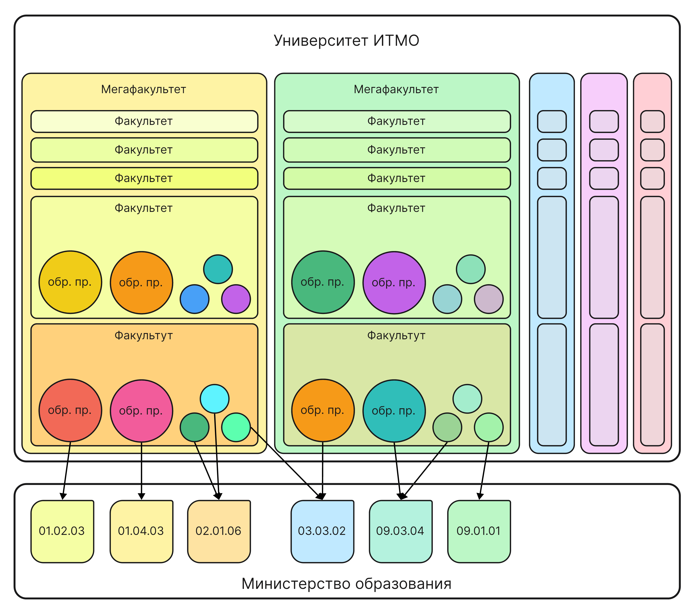

# Частые вопросы про направления ФПИиКТ
[⬅Полезная информация](./index)

## Административное устройство ИТМО
### 1.1. 
> Чем *мегафакультет* отличается от *факультета*? 

Условно, образование в ИТМО можно разделить:
1. Мегафакультет (например, КТиУ)
2. Факультет (например, ПИиКТ)
3. Образовательная программа (например, СППО)

**Образовательная программа** — это набор предметов, дисциплин отвечающий определенному [*направлению*](https://base.garant.ru/70480868/53f89421bbdaf741eb2d1ecc4ddb4c33/) (=код от мин. обр.). Разные образовательные программы, отвечающие одному направлению, могут различаться: разные преподаватели, дополнительные предметы и т.д., проще говоря, это *красивое* название, придуманное университетом.
- заявление на поступление подается на *направление* ❗❗ (см [1.3.](#13) для большего пояснения)

**Факультет** — объединение образовательных программ. 

**Мегафакультет** — это что-то вроде кафедры, такие крупные объединения факультетов общей направленности: физика, биология, программирование, информатика, экономика...
- раньше были кафедры, но потом их упразднили и оставили мегафакультеты 

Схематично можно изобразить так:

### 1.2. 
> Что такое ВТ?

*ВТ* (Вычислительная техника) — название кафедры, которая раньше существовала; сейчас употребляется для обозначается для группы обр. программ направленных на углубленное изучение работы компьютера, условно ~ СППО + ИВТ.
- см. [стикеры в тг](https://t.me/addstickers/trueVT).

### 1.3.
> Куда я попаду, подавая заявление на выбранное направление?

(отсылка к [1.1.](#11))

Сложность состоит в том, что абитуриент выбирает именно *образовательную программу*, которая соответствует конкретному *направлению подготовки*, определенному мин. обр.

Конкурс на зачисление происходит в рамках одного направления подготовки. Поэтому есть нюансы:
- именно на направления выделяются бюджетные места,
- разные обр. программы могут делить общие бюджетные места, например, СППО и Нейротех.

Процесс подачи заявления на поступление выглядит **примерно** так: Абитуриент
1. выбирает на сайте [abit.itmo.ru](https://abit.itmo.ru) понравившиеся ему образовательные программы (*красивое* название),
2. убедиться, что обр. программы соответствующие разным *направлениям подготовки* (= код),
3. составляет заявления на конкурс по выбранным обр. программам,
4. подтверждает свое намерение, принося аттестат.

## Образование
## 2.1. 
> Кем я стану, когда окончу СППО/ИВТ?

Образовательные программы привязаны к направлению подготовки (см [1.1.](#1.1.)), это объясняется в первой же лекции по предмету "Основы профессиональной деятельности".

СППО = Программная Инженерия 09.03.04
ИВТ = Информатика и Вычислительная техника 09.03.01
- вырезка из презентации: [t.me/abit_cse/1874](https://t.me/abit_cse/1874).

Можно научиться [*системному программированию*](https://youtu.be/ywUvhPsd6Ew), работе с микроконтроллерами, разработке сложных приложений и др.

### 2.2
> Чем СППО отличается от ИВТ?

Если очень грубо:
- ИВТ = процессоры, микросхемы,
- СППО = операционные системы, веб-технологии.

Подробнее:
- на ИВТ занимаются более *низкоуровневым* программированием, работа идет ближе *к железу*: процессоры и микросхемы, есть предметы функциональной схемотехники (не паять, а рисовать схемы),
- на СППО занимаются более *высокоуровневым* программированием, работа идет на более высоком уровне абстракций: высоконагруженные системы, облачные сервисы.

При этом нужно понимать, что есть возможности совмещения этих образовательных программ: 
- ~~специализации~~ (было)
	- СППО: ПИС (веб) + Системное Программное Обепечение (железо),
	- ИВТ: Встроенные системы (железо) + Распределенные Системы и Сети (веб);
- **майноры** (стало)
	- хз, еще не сталкивались, можно более точно выбирать набор предметов.

### 2.3.
> Что лучше: КТ или СППО?

Во-первых, КТ это тоже условное название направления Прикладная математика и информатика на факультете ИТиП, как условное название ВТ (см [1.2.](#12)).

Это разные направления подготовки (см. [1.1](#11)):  КТ Прикладная Математика и Информатика (ПМИ) и СППО Программная Инженерия (ПИ). Отсюда вся разница:
- КТ  — это больше про математику, про алгоритмы, высокоуровневое программирование, работу с компьютером,
- СППО/ИВТ — это больше про компьютерное железо, системы, устройство/разработку компьютера.

Так же на обр. программах свои наборы предметов, которые достаточно сильно отличаются (см. [2.5./КТ](#25)). 
- На КТ по умолчанию более сильная, более абстрактная математика,
- На ВТ 2 потока: продвинутая и базовая (см. [2.4.](#24)).
 
### 2.4. 
> Что с математикой на СППО?

В 2021 году затеивались изменения в образовании на ВТ, но из-за политической ситуации активность изменений упала.

#### 2.4.1.
> Что такое *продмат*?

Основные разделы математики.

На ВТ с 2021 года 2 потока математики: 
- продвинутая математика (*продмат*),
- базовая математика (базмат).

*Продмат* — курсы более абстрактной математики, они содержат:
- курс [алгебры](https://logic.pdmi.ras.ru/~dvk/ITMO/Algebra) ([Карпов Д. В.](https://logic.pdmi.ras.ru/~dvk/)),
- курс [дискретной математики](https://logic.pdmi.ras.ru/~dvk/ITMO/DM) ([Карпов Д. В.](https://logic.pdmi.ras.ru/~dvk/), [Пастор А. В.](https://logic.pdmi.ras.ru/~pastor/)),
- курс [математического анализа](https://youtube.com/playlist?list=PLx5jwZiVE4CVattiY9JA_k03Chu6FtcMp) ([Бойцев А. А.](https://www.youtube.com/@user-kc3hm4oe9p)).
Преподаватели на продмате прежде преподавали на КТ и ИБ. (Непонятно, кто будет вести у первого курса, т.к. Бойцев сейчас занят) 

*Базмат* — в основном старые курсы (после ввода продмата пришлось добавить и доработать некоторые вещи) математики, которые проходят, как правило, больше тем, чем на продмате, но более *поверхностно*. Так же есть важные темы, которые направлены на будущую профессиональную деятельность, которых нет на *продмате*. 

#### 2.4.2.
> Как попасть на *продмат*?

В начале года проводится тестирование, после успешного прохождения которого вы можете попасть в поток продвинутой математики.
- Тестирование скорее формальное, для собственной оценки сил, т.к. даже без него можно попасть на продмат, показав свою решимость.
- Как правило, большая часть возвращается на базмат в течение первого семестра из-за высокой нагрузки.

#### 2.4.3.
> Хочу изучать математику, что еще есть?

В рамках модуля внутреакадемической мобильности [ОГНП](https://student.itmo.ru/ru/elective_module/) можно выбрать курсы с КТ:
- математическая логика (курс на stepik от [@shd](https://github.com/shd)),
- функциональный анализ.

Так же есть общие курсы других разделов математики:
- математическая статистика,
- теория вероятностей,
- вычислительная математика, 
- машинное обучение
(см. [online-курсы 2.5.](#25)).

Общие курсы математики **трудно назвать очень хорошими** (искл. онлайн-курсы), но они дают базовые представления о разделах математики, подходят для тех, кто слабо знаком с математикой.

### 2.5.
> Что с переводами между образовательными программами?

Переводы между образовательными программами бывают, но не очень часто.

В основном люди переводятся между СППО/ИВТ и нейротехом, т.к. очень схожие образовательные программы.

Не выдержавшие обучения на ВТ часто переходят на Технологии в Дизайне (см. [3.1.](#31)).

Есть случаи перехода с ВТ на КТ, но в этом случае достаточно большая академ-разница и очень трудно закрыть долги, чем позже переход, тем сложнее.

Бывает люди переводятся из других вузов, бывает даже с не очень похожих направлений. 

### 2.4. 
> Что с физикой на ВТ?

Физика есть, в новом учебном плане она должна быть на 2м курсе. Глубокого знания физики не требуется, обучение начинается с основ с применение полученных знаний по математическому анализу.

Обещают новую учебную программу физики, более полезную, с уклоном на практическое применение (?). Ее ни у кого не было, поэтому сказать сложно, что получится.

В 2022г. на ИВТ была в экспериментальном режиме новая физика, вроде бы она всем *понравилась* и была "*очень* простая".
В это время на СППО была старая физика, качество которой зависело от преподавателя: бывало душно и непонятно, а бывало непринужденно и понятно.

### 2.5.
> Какие онлайн курсы на ВТ?

В ИТМО много общеуниверситетских онлайн-курсов. Вот примеры изучаемых на ВТ:
- [введение в цифровую культуру](https://openedu.ru/course/ITMOUniversity/DIGCUL/?session=fall_2021_ITMO),
- [хранение и обработка данных](https://openedu.ru/course/ITMOUniversity/DATST/?session=spring_2022_ITMO_bac),
- [прикладная статистика](https://openedu.ru/course/ITMOUniversity/APPSTAT/?session=fall_2022_ITMO),
- [машинное обучение](https://openedu.ru/course/ITMOUniversity/MLDATAN/?session=spring_2023_ITMO_bac),
- [Безопасность жизнедеятельности](https://openedu.ru/course/ITMOUniversity/LSBASIC/?session=spring_2023_ITMO) (БЖД),
- [Встроенные системы](https://openedu.ru/course/ITMOUniversity/EMBSYS/?session=spring_2023_ITMO),
- ....
- Вычислительная математика (?).

Качество курсов есть разное, т.к. их составляют разные люди. Например, 
- БЖД выглядит как бесполезная трата времени, 
- Цифровая культура довольно поверхностная и *прошаренным юзерам* вообще не пригодится,
- Встроенные системы в принципе неплохой курс, для начинающих.

Отдельное внимание хочется уделить курсам, в которых участие принимает Антон Бойцев. Не знаю, его это заслуга или нет, но у них высокое качество:
- курс прикладной статистики на 2 курсе 3 семестр обучения покрывает курс теории вероятностей и статистики на 2 курсе 4 семестр,
- в каждом курсе есть проработанные текстовые материалы, которые можно использовать как самостоятельный учебник.

Онлайн курсы, как правило, не вызывают трудностей при прохождении, если не пропускать *дедлайны*.

### 2.6.
> Стоит ли поступать в ИТМО?

ИТМО, **как и другие вузы** не обделен недостатками.
Перечислим некоторые плюсы и минусы ИТМО. 
- см. [презентацию для абитуриентов](https://t.me/abit_cse/460)

Не стоит.

## Внеучебная жизнь
### 3.1.
> Что на ВТ с девушками?

По непонятным причинам 😕 на ВТ очень мало девушек, в сравнении с другими факультетами. После первого семестра большая их часть еще и переходит на Дизайн.

Но это не страшно, ведь есть общеуниверситетские занятия типа Soft Skills (КиК, ТПВ...), где можно обзавестись интересными знакомствами.
